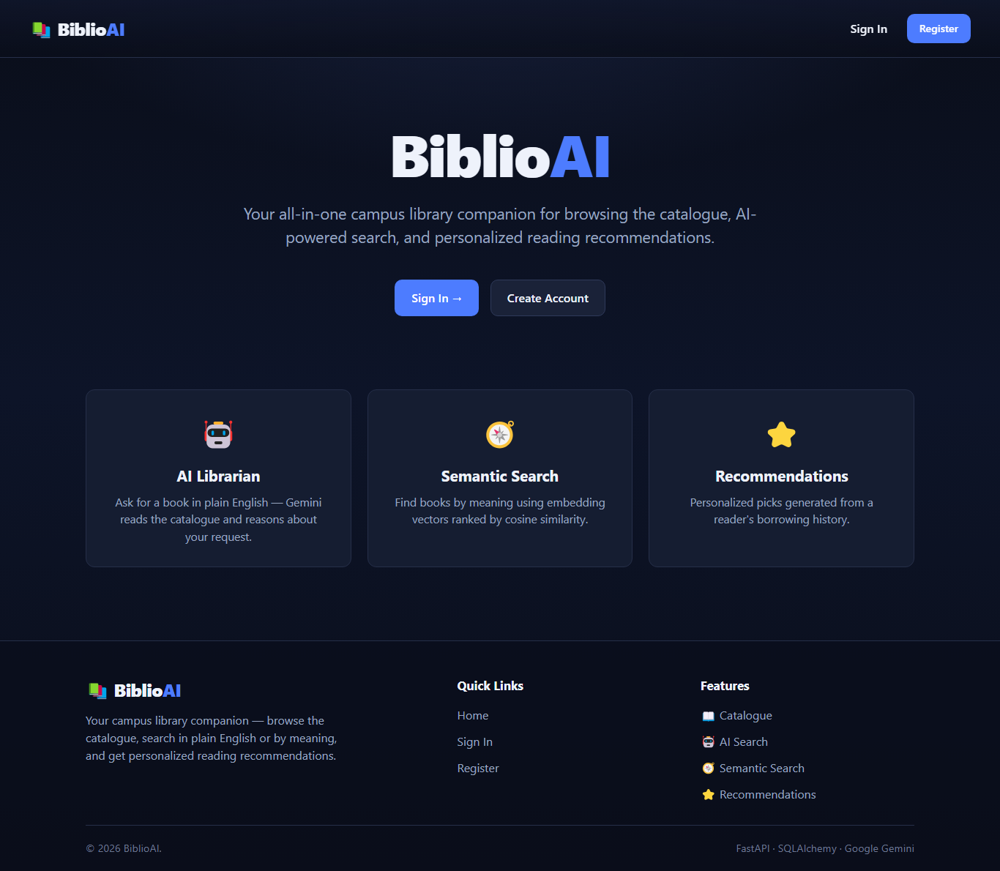
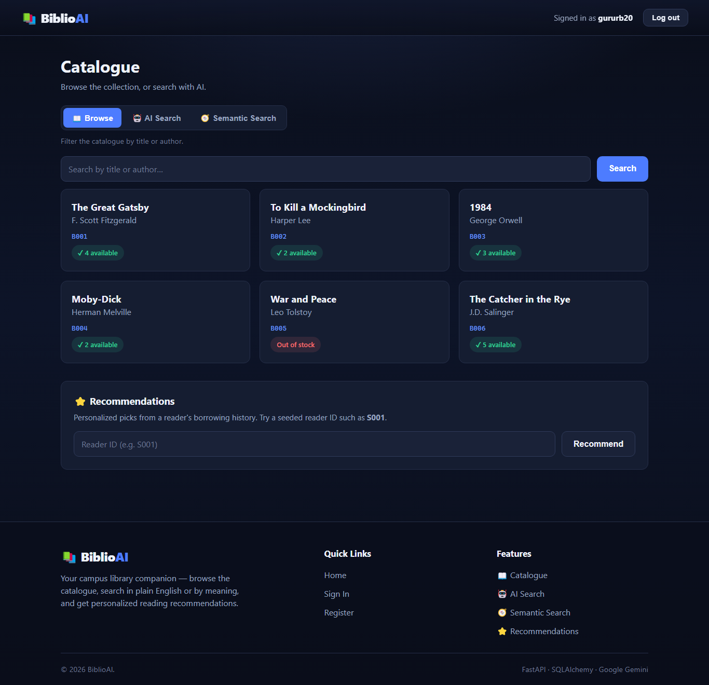
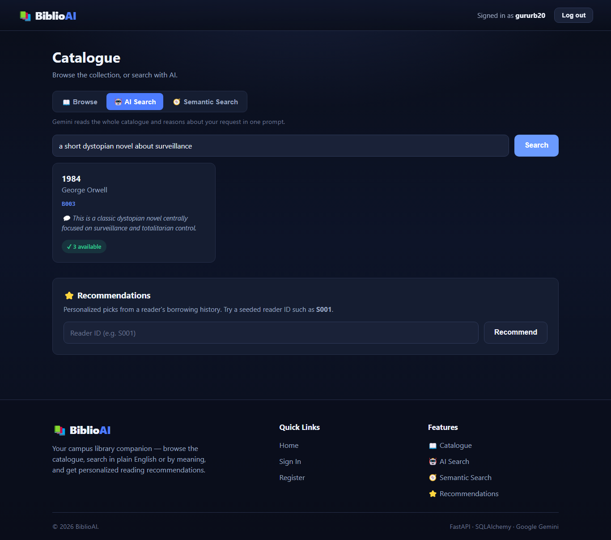
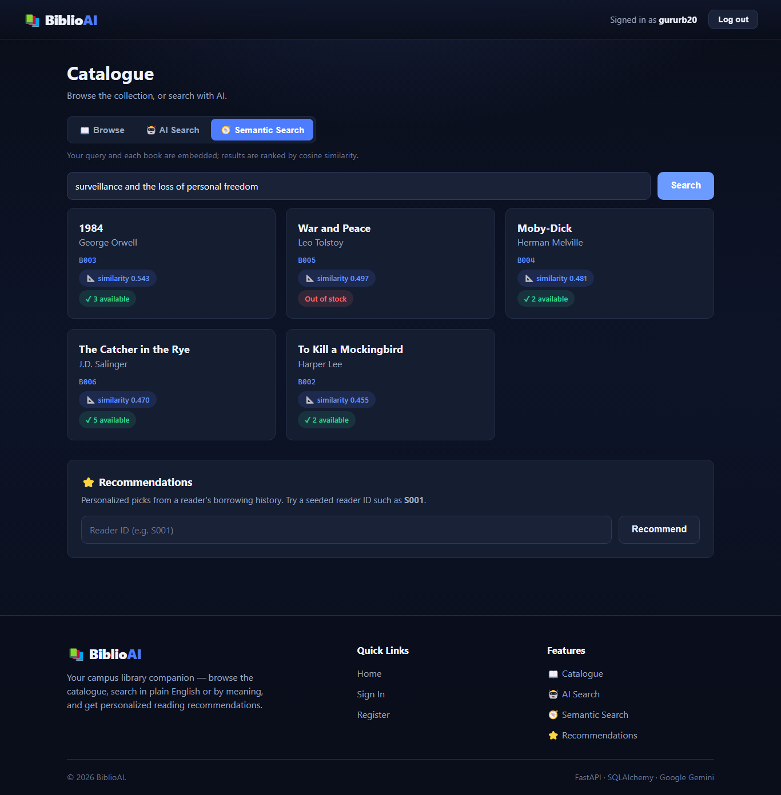
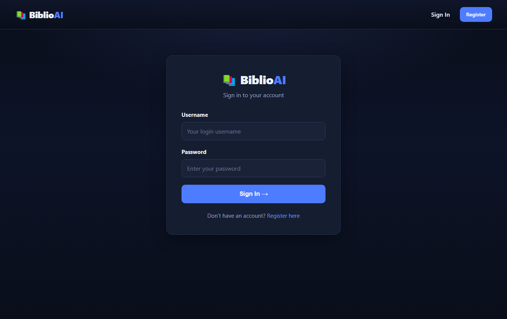

# 📚 BiblioAI

**An AI-powered campus library** — browse the catalogue, search in plain English or by meaning, and get personalized reading recommendations.




BiblioAI began as a single-file **Tkinter desktop app** and grew into a full-stack system: a **FastAPI + SQLAlchemy** REST API with JWT auth and role-based access, a polished **customer web app** (served by the same backend), and a **Streamlit staff console** — with an AI layer powered by **Google Gemini**. It runs locally on SQLite by design.

---

## ✨ Features

- **AI Librarian** — ask for a book in plain English; Gemini reasons over the catalogue and returns validated matches.
- **Semantic Search** — books and queries are embedded; results are ranked by cosine similarity (computed in Python — no vector DB).
- **Recommendations** — personalized picks generated from a reader's borrowing history.
- **Circulation & analytics** — issue/return with penalty rules, plus most-borrowed titles, penalty revenue, and loan stats (staff console).
- **Auth & roles** — JWT + bcrypt, with student (read-only) vs. librarian (write) access.
- **Graceful degradation** — with no API key, AI endpoints return `503` and everything else keeps working.

## 🖼️ Screens

| Catalogue dashboard | AI Search |
|---|---|
|  |  |

| Semantic Search | Sign in |
|---|---|
|  |  |

## 🧱 Tech stack

| Layer | Tech |
|---|---|
| API | FastAPI, SQLAlchemy 2.0, SQLite, PyJWT, bcrypt, pydantic-settings |
| AI | Google Gemini (`gemini-2.5-flash` chat + `gemini-embedding-001`), numpy |
| Customer web app | Vanilla HTML/CSS/JS SPA (no build step), served by FastAPI at `/app` |
| Staff console | Streamlit |
| Legacy | Original Tkinter + CSV app, kept under `legacy/` for provenance |

## 🏗️ Architecture

```
 customer web app (/app)  ─┐
                           ├─▶  FastAPI  ──▶  SQLite (users · books · students · borrow_records)
 Streamlit staff console ─┘        │
                                   └─▶  Google Gemini  (chat + embeddings)
```

```
backend/            FastAPI API + customer web app mount (source of truth)
  ├── app/          config · models · schemas · security · routers · ai_service · embeddings_service
  └── seed/         seed CSVs
frontend_web/       customer web app (index.html · styles.css · app.js)
streamlit_app/      staff console (Streamlit)
legacy/tkinter_app/ the original desktop app
```

## 🚀 Quick start

**Backend + API + customer web app**

```bash
cd backend
python -m venv .venv && .venv\Scripts\activate      # Windows (use source .venv/bin/activate on macOS/Linux)
pip install -r requirements.txt
cp .env.example .env                                # add GEMINI_API_KEY to enable AI (optional)
python -m app.seed_data                             # seed data + create the librarian account
python -m app.seed_embeddings                       # backfill embeddings (needs GEMINI_API_KEY)
uvicorn app.main:app --reload
```

- 🌐 **Customer web app:** http://localhost:8000/app/
- 📘 **API docs:** http://localhost:8000/docs

**Staff console (optional)**

```bash
cd streamlit_app
python -m venv .venv && .venv\Scripts\activate
pip install -r requirements.txt
cp .env.example .env                                # API_URL=http://localhost:8000
streamlit run app.py                                # http://localhost:8501
```

See [backend/README.md](backend/README.md) for the full API surface and environment variables.

## ⚠️ Known limitations

Deliberate tradeoffs for a local portfolio project:

- **SQLite, single-writer** — great for one user locally; concurrent writers would need Postgres.
- **Schema via `create_all`, not migrations** — after a model change, delete `library.db` and re-seed.
- **JWT in browser session memory** — no hard-refresh survival (avoids `localStorage` token theft).
- **Embeddings on create/backfill only** — an edited book re-embeds via `seed_embeddings.py --force`.
- **AI is optional & non-deterministic** — degrades to `503` without a key; ranking in Python suits a small catalogue.

## 📌 Disclaimer

Built for academic and portfolio purposes. **Redistributing or presenting this project as your own is prohibited.**

---

## License

Released under the [MIT License](LICENSE).